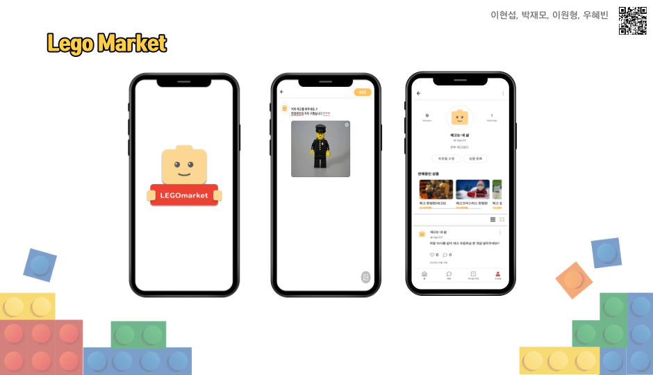
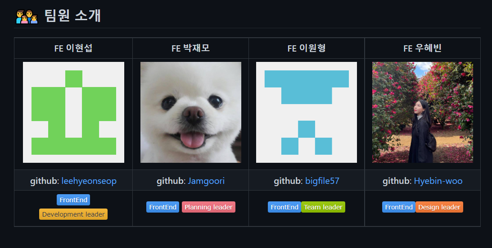

# 레고 마켓

## 1. 프로젝트 소개



### 1.1💡 프로젝트 명: 레고마켓

> **🔗 배포 URL:** [https://fir-project-3397b.web.app](https://fir-project-3397b.web.app/)

```jsx
🟥  SNS와 마켓 서비스를 제공합니다.

🟨  레고를 판매, 홍보할 수 있습니다.

🟩  팔로우를 통해 게시물을 구경하며, 원하는 게시물에 '좋아요'를 누르거나 댓글을 달수 있습니다.

🟦  레고가 없어도 플랫폼을 이용할 수 있습니다.
```

## 1.2 개발 환경

### ⚙️   사용기술 
  

### 배포


### **🔎   이슈 관리**

- [🔗 GitHub](https://github.com/likelion-14-project/lego-market), [🔗 GitHub_Project](https://github.com/likelion-14-project/lego-market/projects/1), [🔗 GitHub_issues](https://github.com/likelion-14-project/lego-market/issues)
- Notion: 기획, 코딩 컨벤션, 회의록

# 2. 팀원 소개



# 3. 기능구현 및 역할 분담


# 4. 핵심기능 시연

| splash                                                 | 회원가입                                                             |
| ------------------------------------------------------ | -------------------------------------------------------------------- |
|         |  |
| 로그인                                                 | 로그아웃                                                             |
|              |                         |
| 프로필수정                                             | 상품등록                                                             |
|  |                     |
| 게시글등록                                             | 채팅                                                                 |
|     |                               |
| 유저검색                                               | 팔로우                                                               |
|       |                       |
| 상품삭제                                               | 게시글삭제                                                           |
|       |                   |
|                                                        |                                                                      |
|                                                        |                                                                      |

## 4. 폴더 구조

```jsx
📦Lego-Market
 ┣ 📂 public
 ┃ ┣ 📂 images           // 이미지 파일 폴더
 ┃ ┣ 📂 icons            // 아이콘 파일 폴더
 ┃ ┗ index.html
 ┃ 📦 src
 ┃ ┣ 📂 components       //스타일도 분리했기 때문에 각각 용도별로 폴더를 나눠서 관리
 ┃ ┃ ┣ 📂 addproduct
 ┃ ┃ ┣ 📂 chat
 ┃ ┃ ┣ 📂 comment
 ┃ ┃ ┣ 📂 follow
 ┃ ┃ ┣ 📂 home
 ┃ ┃ ┣ 📂 join
 ┃ ┃ ┣ 📂 login
 ┃ ┃ ┣ 📂 modal
 ┃ ┃ ┣ 📂 post
 ┃ ┃ ┣ 📂 postdetail
 ┃ ┃ ┣ 📂 postModify
 ┃ ┃ ┣ 📂 postupload
 ┃ ┃ ┣ 📂 productlist
 ┃ ┃ ┣ 📂 profile
 ┃ ┃ ┣ 📂 search
 ┃ ┃ ┗ 📂 ui             // 공통으로 사용되는 컴포넌트 폴더
 ┃ ┣ 📂 context          // 로그인 한 사용자 정보를 담기 위한 context 파일 관리 폴더
 ┃ ┣ 📂 hooks            // 만들어서 사용한 훅 폴더
 ┃ ┣ 📂 pages            // 페이지 컴포넌트
 ┃ ┣ 📂 routes           // 라우터 파일 관리
 ┃ ┣ 📂 styles           // 전역 styled-component 관리
 ┃ ┣ 📜 App.jsx
 ┃ ┣ 📜 Portal.js
 ┃ ┗ 📜 index.js
 ┣ 📜 .gitignore
 ┣ 📜 README.md
 ┣ 📜 package-lock.json
 ┗ 📜 package.json
```

## 5. 주요코드

### 5.1 **페이지마다 있는 UI 재사용 하도록 구현**

<hr>

상단 네비게이션 바인 TopNav와 재사용 예

```jsx
function TopNav(props) {
    const { leftChild, centerChild, rightChild } = props;

    return (
        <Wrapper>
            <Left>{leftChild}</Left>
            <Center>{centerChild}</Center>
            <Right>{rightChild}</Right>
        </Wrapper>
    );
}
```

Home페이지에서 재사용한 TopNav 컴포넌트

```jsx
<TopNav
    leftChild={<HeaderStrong>레고마켓피드</HeaderStrong>}
    rightChild={
        <HomeHeaderImg
            src={process.env.PUBLIC_URL + "/icons/icon-search.png"}
            alt="피드찾기"
            onClick={() => navigate("/search")}
        />
    }
/>
```


Search페이지에서 재사용한 TopNav 컴포넌트

``` jsx
<TopNav
    leftChild={<BackButton />}
    centerChild={<SearchInput placeholder="계정검색" onChange={onChange}></SearchInput>}
/>
```


### 5.2 **context를 사용하여 로그인 한 사용자 정보를 관리**

로그인 요청 또는 프로필 수정 시 서버에서 오는 데이터를 **context**에 저장해서 **Props Driling**을 피하고 어느 컴포넌트에서든 로그인한 유저의 정보를 사용할 수 있게 하였습니다.

```jsx
import { createContext, useReducer } from "react";

const AuthContext = createContext();

const authReducer = (state, action) => {
    switch (action.type) {
        case "login":
            return { ...state, user: action.payload };
        case "modify":
            return { ...state, user: action.payload };
        default:
            return state;
    }
};

const AuthContextProvider = ({ children }) => {
    const [state, dispatch] = useReducer(authReducer, {
        user: null,
    });

    return (
        <AuthContext.Provider value={{ ...state, dispatch }}>
            {children}
        </AuthContext.Provider>
    );
};

export { AuthContext, authReducer, AuthContextProvider };

```

```jsx
import { useContext } from "react";
import { AuthContext } from "../context/AuthContext";

export const useAuthContext = () => {
    const context = useContext(AuthContext);
    return context;
};
```

저장해둔 user 정보를 프로필 페이지에서 사용한 경우입니다.

```jsx

import React from "react";
import styled from "styled-components";
import { useParams } from "react-router-dom";
import { useAuthContext } from "../../hooks/useAuthContext";

import Profile from "../../components/profile/profile/Profile";
import ProfilePost from "../../components/post/profilePost/ProfilePost";
import ProductList from "../../components/productlist/ProductList";

const ProfileMainWrap = styled.div`
    min-width: 390px;
    width: 100%;
    height: calc(100% - 61px);
    overflow-y: auto;
    overflow-x: hidden;
`;

function ProfilePage() {
    const { accountname } = useParams();
    const { user } = useAuthContext();

    let profileAccountName;
    let myAccountName;
    if (user) {
        myAccountName = user.accountname;

        accountname === undefined
            ? (profileAccountName = myAccountName)
            : (profileAccountName = accountname);
    }

    return (
        <ProfileMainWrap>
            <Profile
                profileAccountName={profileAccountName}
                myAccountName={myAccountName}
            />
            <ProductList
                profileAccountName={profileAccountName}
                myAccountName={myAccountName}
            />
            <ProfilePost profileAccountName={profileAccountName} />
        </ProfileMainWrap>
    );
}

export default ProfilePage;

```


### 5.3 **API 요청**

비슷한 API 요청들을 훅으로 구현해서 사용하는 방법과 요청들을 하나의 파일에 모아서 사용하는 방식 두 가지로 진행했습니다. 이건 여러 방법들을 시도해 보자는 학습적인의도로 진행했습니다.

요청을 모아서 사용하는 방법에선 아래와 같이 API 주소를 기본값으로 설정해서 따로 입력하지 않도록 했습니다. 또 요청을 하는 시점에 토큰 값을 조회해서 헤더에 넣어주도록 했습니다.

```jsx
// /src/componenets/hooks/useAxios.jsx 파일
import axios from "axios";
// baseURL 설정
axios.defaults.baseURL = "https://mandarin.api.weniv.co.kr";
axios.defaults.headers["content-Type"] = "application/json";
// 요청하기전에 헤더에 토큰 추가
axios.interceptors.request.use(
    function (config) {
        config.headers["Authorization"] = `Bearer ${localStorage.getItem("token")}`;
        return config;
    },
    (error) => {
        return Promise.reject(error);
    }
);
```

요청 메서드와 경로를 넣어서 값을 반환하는 함수를 하나의 요청마다 만들어서 사용했습니다.

```jsx
// 팔로우한 게시글 불러오기
export const getFeedPost = async () => {
    console.log("getFeedPost-Called");
    const config = {
        method: "GET",
        url: `/post/feed`,
    };
    try {
        const response = await axios.request(config);
        return response;
    } catch (error) {
        console.log(error);
    }
};
```

만든 함수는 아래와 같이 필요한 컴포넌트에서 import 해서 async-await 로 반환값을 state 변수로 관리해 사용 했습니다.

```jsx
import { getFeedPost } from "../../hooks/useAxios";
....

const Home = () => {
    const [postData, setPostData] = useState();
    const navigate = useNavigate();

    useEffect(() => {
        (async () => {
            const res = await getFeedPost();
            setPostData(res);
        })();
    }, []);
```

유사한 요청을 훅으로 만들어 사용한 경우입니다.
대표적으로 댓글, 게시물, 상품의 삭제 요청이 동일해서 재사용하면 좋을 거 같아 아래와 같이 구현했습니다.

```jsx
import { useState } from "react";

export const useDelete = () => {
    const [isUpdate, setIsUpdate] = useState(false);
    const remove = async (addUrl) => {
        try {
            const token = localStorage.getItem("token");
            const serverUrl = "https://mandarin.api.weniv.co.kr";
            const url = serverUrl + addUrl;

            const res = await fetch(url, {
                method: "DELETE",
                headers: {
                    Authorization: `Bearer ${token}`,
                    "Content-type": "application/json",
                },
            });
            const json = await res.json();
            console.log(json);
            setIsUpdate(!isUpdate);
        } catch (error) {
            console.log(error);
        }
    };
    return { remove, isUpdate, setIsUpdate };
};
```

댓글삭제 기능에서 아래와 같이 사용했습니다.

```jsx
const [deleteAlertModal, setDeleteAlertModal] = useState(false);

...

const deleteAlertButton = {
        content: "삭제",
        onClick: () => {
            remove(`/post/${post_id}/comments/${comment_id}`); 
            // 클릭 시 삭제요청
            setModal(false);
            setDeleteAlertModal(false);
   },
};
```

### 5.4 **하단 네비게이션 바**

하단 네비게이션 바를 만들었는데 필요한 페이지, 필요하지 않은 페이지들이 있어서 필요한 컴포넌트에만 넣어서 사용해야 하나 고민하다가 라우팅중첩을 이용해 아래처럼 필요한 페이지들만 묶어서 구현했습니다.

```jsx
const WithNav = () => {
  return (
      <>
          <NavBar />
          <Outlet />
      </>
  );
};
export default WithNav
```

```jsx
<Route element={<WithNav />}>
    <Route path='/home' element={<Home />} />
    <Route path='/search' element={<SearchUserPage/>}/>
    <Route path='/myprofile' element={<ProfilePage/>} />
    <Route path='/myprofile/:accountname' element={<ProfilePage/>} />
    <Route path='/follow/:accountname/:type' element={<FollowPage/>}/>
    <Route path='/editpost' element={<PostUploadPage/>} /> 
    <Route path='/chat/list' element={<ChatPage/>} />
    <Route path='/chat/:id' element={<Chat/>} />                                     
    <Route path='/productlist' element={<ProductListPage/>} />                 
    <Route  path='/product'  element={<AddProductListPage/>} />                                   
</Route>
```

## 6. 이슈 및 해결

1. 게시글 삭제 “ 왜 바로 삭제 안돼,,”
    - 게시글을 삭제 시 삭제가 바로 반영이 되지 않아서 window.location.onload() 로 새로고침을 강제로 해줬습니다. 그런데 삭제할 때마다 딜레이가 되어 문제가 발생
    - 고민하다가 삭제 버튼을 누르는 시점에 유저의 데이터를 가져오는 컴포넌트(ProfilePost)에 데이터를 갱신하도록 refetch state 변수를 설정하여 해결
2. SearchUser 페이지 “키워드를 입력하기 전에 결과 뜨지 않도록 하기”
    - SearchUser 페이지에 들어갔을 때 키워드를 입력하지 않아서 모든 유저들을 불러오는 문제가 있었는데
        전달하는 값이 “ ” 빈 값일 때 값을 반환하지 않도록 false를 넣어줘서 해결했습니다.

    ```jsx
    export const searchUser = async (keyword) => {
        const config = {
            method: "GET",
            url: `/user/searchuser/`,
            params: {
                keyword: keyword === "" ? false : keyword,
            },
        };
        try {
            const response = await axios.request(config);
            return response;
        } catch (error) {
            console.log(error);
            throw error;
        }
    };
    ```

3. headers 오타 “왜 에러가 안 날까?”
    - api 요청 시 headers 설정에서 “**s”**를 넣지 않았는데 에러 표시가 뜨지 않아서 오류를 찾는데 많은 시간이 지체되었던 점.

## 7. 프로젝트 후기

### 아쉬운점

- 프로젝트 초반 깃 활용 어려움으로, 깃 플로우 전략 늦게 사용 (main - develop - feature 3가지만 써서 제대로 사용하진 못했다)
- 잦은 깃 충돌로 인해 많은 시간 지체
- 기능 구현을 최우선으로 진행하여 문서화를 자세하게 하지못함
- 프로젝트 막바지에 스타일 컴포넌트 분리 작업

### 잘한점

- 99% 비대면 회의 진행: 수업 후, 매주 평일 2시간씩 회의하며 작업 내용 공유 및 일정 관리
- 매일 서로 해결되지 않는 문제들을 공유하며 함께 문제 해결, 리액트 스터디를 진행하여 개념 이해

### 계획

- 8월 둘째 주까지 추가적으로 남은 기능 구현(게시물수정, 신고)와 최적화를 위해 계속해서 업데이트 예정
    최적화 중에 큰 용량의 이미지을 받았을 때 이미지를 리사이징해서 사용하는 방법을 먼저 적용해 보고 싶습니다.

